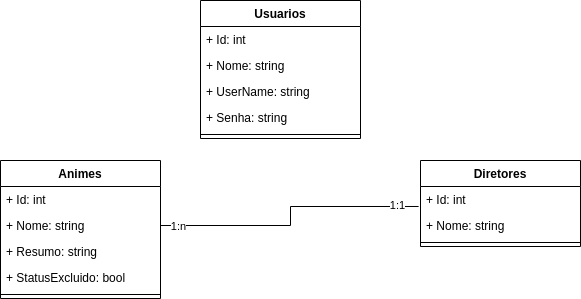

# Anime API
## Descricao
Desafio técnico de uma biblioteca de animes feita utilizando Arquitetura Clean
## Componentes

### Bibliotecas de Classe
 - Animes.Application
 - Animes.Domain
 - Animes.Infra.Data
 - Animes.Infrastructure.IoC
 ### Web Application
 - Animes.Web.Mvc

 ### XUnit
 - Animes.Application.Test
 - Animes.Domain.Test

## Tecnologias e Ferramentas

 ### Banco de Dados Utilizado para testes
 - 10.4.32-MariaDB 

 ### Tipo de autenticação
 - JWT

 ### Frameworks
 - dotNet 8
 - Entity Framework Core 8

 ### Documentação
 - Swagger

## Diagramas

 ### Classe
 - 

## Instruções
 ### Configuração
 - Vá em Animes.Web.Mvc/appsettings.json
 - Altere o valor de DefaultConnection para o do seu banco de dados MySQL ou MariaDB
 - Utilize o comando de migration do Entity Framework Core no projeto Animes.Infra.Data 
 
 
       dotnet ef database update --startup-project ../Animes.Web.Mvc --project .

 - Em Animes.Web.Mvc utilize o comando 

       dotnet run

## Referências
 - https://www.macoratti.net/20/10/aspnc_impclean1.htm
- https://medium.com/@microclip.lakeesha/asp-net-core-6-restful-web-api-with-mariadb-9cdb48d46b9c